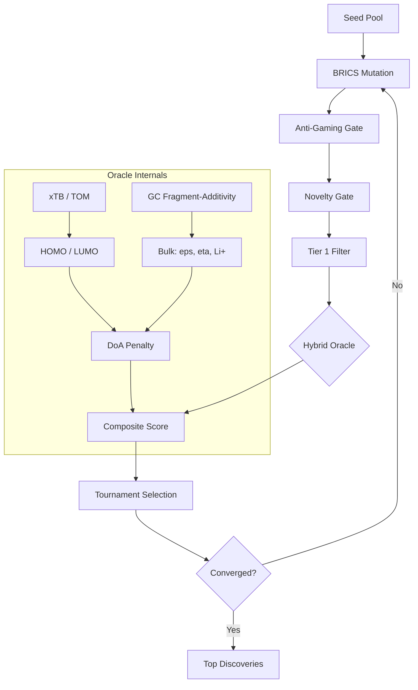

# Project Aurelius v10.0

**Novel molecule discovery for battery electrolytes.**

A physically-grounded Evolutionary Algorithm pipeline with a **hybrid quantum + fragment-additivity oracle**. Frontier orbitals (HOMO/LUMO) are predicted via quantum chemistry (xTB/GFN2-xTB preferred, Topological Orbital Model fallback) — bulk properties (dielectric, viscosity, Li+ solvation) via interpretable group-contribution fragment-additivity.

## Why Hybrid?

| Property | Method | Rationale |
|----------|--------|-----------|
| HOMO / LUMO | QuantumOracle (xTB or TOM) | Orbitals are delocalised quantum phenomena — NOT additive. GC would be "gamed" by stacking fragments. |
| Dielectric ε | GC fragment-additivity + TPSA | Bulk polarity is reasonably additive. |
| Viscosity | GC fragment-additivity + MW + RotB | Transport properties correlate with group contributions. |
| Li+ Solvation | GC fragment-additivity | Donor-number additivity is physically valid. |
| Ionic Conductivity | Walden-product proxy (ε, η, Li⁺) | Unifies salt dissociation, mobility, and charge-carrier availability into a single figure of merit. |

The hybrid oracle (non-linear quantum HOMO/LUMO + additive GC bulk properties) keeps the pipeline physically grounded while maintaining interpretability. A Walden-product conductivity proxy combines dielectric, viscosity, and Li+ solvation into a unified transport metric.

## Architecture



## Overview

| Component | Framework | Purpose |
|-----------|-----------|---------|
| Filter | RDKit | Electrolyte viability (MW, HBD, RotB, SA score) |
| Oracle | Quantum + GC | HOMO/LUMO from xTB/TOM; bulk (ε, η, Li⁺, σ) from fragment-additivity + Walden-product conductivity proxy |
| Mutation | SMARTS + BRICS | Targeted electrolyte edits + scaffold hopping |
| Selection | Tournament Selection | Tanimoto-guided evolutionary diversity pressure |

The composite Aurelius Score is computed via Gaussian LUMO reward (SEI formation window), sigmoid HOMO penalty (oxidative stability threshold), sigmoid dielectric/viscosity/Li-solvation/conductivity rewards, and SA score penalty. Tournament selection with a Tanimoto diversity penalty steers each generation away from chemical saturation.

## Installation

Since Aurelius relies on RDKit's C++ bindings, we recommend a conda-first installation.

```bash
# 1. Create and activate a conda environment with Python 3.11 and RDKit
conda create -n aurelius python=3.11 rdkit -c conda-forge
conda activate aurelius

# 2. Install Aurelius directly from GitHub
pip install git+https://github.com/tomwolfe/ProjectAurelius.git
```

## Quick Start

```bash
aurelius init                         # Initialize pipeline
aurelius doctor                       # Validate dependencies
aurelius doctor-xtb                   # Check xTB quantum backend
aurelius screen "CC(=O)OC1=CC=CC=C1" # Screen a molecule
aurelius batch examples/molecules.smi --output results.json  # Batch screen
aurelius agent --max-generations 50   # Run autonomous discovery loop
```

## CLI Reference

```
aurelius init                    Initialize pipeline
aurelius doctor                  Validate dependencies and hardware
aurelius doctor-xtb              Check xTB quantum backend availability
aurelius screen <smiles>         Screen a single molecule
aurelius batch <file>            Screen molecules from SMILES file
aurelius score <smiles>          Compute Aurelius score only
aurelius evaluate <smiles>       Run ML oracle evaluation
aurelius validate <smiles>       Run full pipeline with detailed scorecard
aurelius agent                   Run the autonomous screening agent
```

## Quantum Backend

### Preferred: xTB (GFN2-xTB)
Install the xTB binary from https://xtb-docs.readthedocs.io and ensure it's on your PATH.
The oracle will automatically detect and use it.

### Fallback: Topological Orbital Model (TOM)
When xTB is unavailable, the oracle falls back to a **Topological Orbital Model** based on
particle-in-a-box and Hückel theory. TOM estimates HOMO/LUMO from:
- Longest conjugation path length (non-linear 1/L² gap scaling)
- Heteroatom perturbation analysis
- Inductive effects from fluorine, sulfone, CF₃ groups
- Wiener-index compactness adjustment (deepens HOMO for compact molecules)
- Nitrile C≡N π* correction (−0.70 eV per C≡N)

TOM is non-linear in molecular topology and cannot be "gamed" by fragment stacking.
Wiener-index compactness improved external HOMO Spearman ρ from 0.20 to 0.52.

## Anti-Gaming Constraints

The mutation engine includes topological safeguards:
- **Max conjugation path**: 16 atoms (prevents infinitely conjugated "Frankenstein" molecules)
- **Min sp³ carbon fraction**: 20% (ensures 3D structural complexity)
- **Max rings**: 3 (electrolytes are small molecules, not drug-like macrocycles)
- **Strained ring rejection**: 3-4 membered rings (electrochemically unstable)

## Project Structure

```
src/aurelius/
├── __main__.py             # CLI entry point
├── agent/
│   ├── loop.py             # DiscoveryLoop (Evolutionary Algorithm)
│   ├── mutation/
│   │   ├── brics.py        # BRICS decomposition / recombination
│   │   ├── engine.py       # Mutation engine orchestration
│   │   ├── harvester.py    # External SMILES harvest / caching
│   │   ├── novelty.py      # Novelty gate (Tanimoto similarity)
│   │   └── smarts.py       # SMARTS-based targeted mutations
│   ├── reporting.py        # Report generation
│   ├── selection.py        # Tournament selection + diversity penalty
│   └── state.py            # Checkpoint, convergence, feedback
├── cli_scripts/            # CLI subcommand package
├── constants.py            # Global constants
├── data/                   # Calibration & benchmark data (JSON)
├── pipeline.py             # Pipeline orchestrator
├── scoring/
│   └── oracle/
│       ├── gc.py           # Group-contribution fragment-additivity
│       ├── oracle.py       # PropertyOracle (composite scorer)
│       └── quantum.py      # xTB / Topological Orbital Model (TOM)
├── screening/
│   └── tier1/filter.py     # Electrolyte viability filter
├── types.py                # Shared type definitions
└── utils/
    ├── chem_utils.py       # Chemical utilities
    └── dependencies.py     # Dependency checks
```

## Scientific References

- Bannwarth, C. et al. "GFN2-xTB — An Accurate and Broadly Parametrized Self-Consistent Tight-Binding QM Method." *J. Chem. Theory Comput.* 2019.
- Morgan, H. L. "The Generation of a Unique Machine Description for Chemical Structures." *J. Chem. Doc.* 1965.
- Heilbronner, E. & Bock, H. "The HMO Model and its Application." *Wiley-VCH* 1976.
- Degen, J. et al. "SMARTS — A Language for Describing Molecular Patterns." *J. Chem. Inf. Model.* 2008.
- Delphi, L. et al. "BRICS: Decomposition and Reassembly of Molecules." *J. Chem. Inf. Model.* 2008.

## License

MIT License
