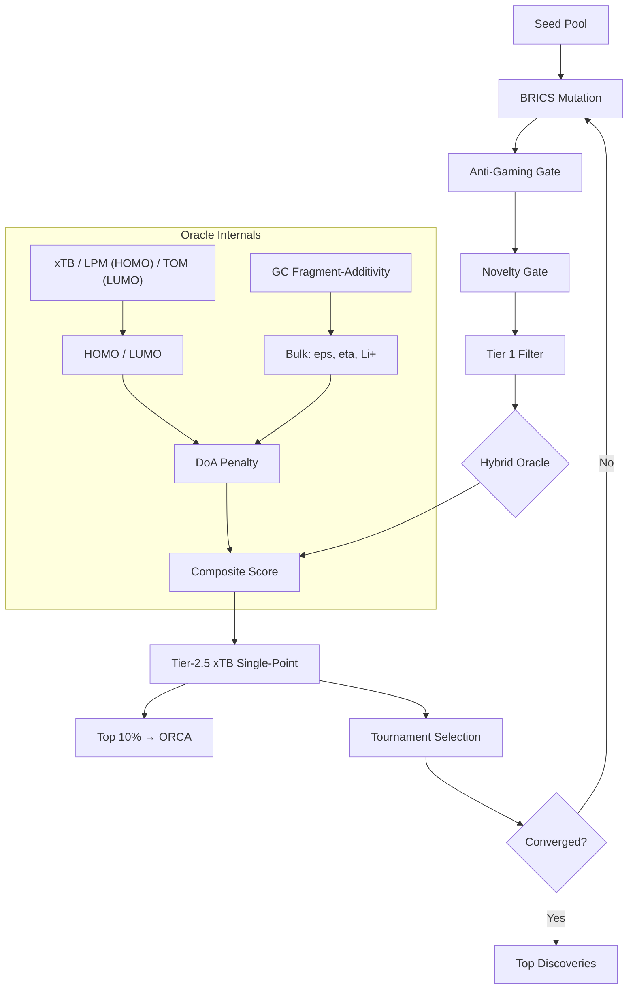

# Project Aurelius v12.1

**Novel molecule discovery for battery electrolytes.**

A physically-grounded Evolutionary Algorithm pipeline with a **hybrid quantum + fragment-additivity oracle**. Frontier orbitals (HOMO/LUMO) are predicted via quantum chemistry (xTB/GFN2-xTB preferred, Lone-Pair Orbital Model fallback) — bulk properties (dielectric, viscosity, Li+ solvation) via interpretable group-contribution fragment-additivity. Reduction stability is predicted by ΔSCF electron affinity (ρ = 0.91 vs 40 measured gas-phase EAs), replacing the frontier LUMO, which sat at the noise floor.

## Why Hybrid?

| Property | Method | Rationale |
|----------|--------|-----------|
| HOMO | QuantumOracle (xTB or **LPM**) | Orbitals are delocalised quantum phenomena — NOT additive. The LPM enumerates candidate ionisable lone-pair orbitals and applies Koopmans' theorem with geometric inductive attenuation. |
| LUMO | QuantumOracle (xTB or TOM) | Reported for calibration/MAE only. Virtual orbitals are not accessible via Koopmans, so LUMO is **not** a ranking input. |
| Reduction stability | **ΔSCF electron affinity** (xTB, or structural ridge) | `EA = E(neutral) − E(anion)` from two GFN2-xTB single points: a real energy difference between two optimised states, so it captures the orbital relaxation Koopmans discards. ρ = 0.91 against 40 measured gas-phase EAs. |
| Dielectric ε | Kirkwood-Fröhlich (closed form) | ε is a bulk orientational response, **not** additive: it scales as μ²g/V_m and spans 2→90. Inputs (McGowan volume, Clausius-Mossotti ε∞, group dipole, correlation factor g) are all structure-derived. |
| Viscosity | GC fragment-additivity + MW + RotB | Transport properties correlate with group contributions. |
| Li+ Solvation | GC fragment-additivity | Donor-number additivity is physically valid. |
| Ionic Conductivity | Walden-product proxy (ε, η, Li⁺) | Unifies salt dissociation, mobility, and charge-carrier availability into a single figure of merit. |

The hybrid oracle (non-linear quantum HOMO/LUMO + closed-form dielectric + additive GC transport properties) keeps the pipeline physically grounded while maintaining interpretability. A Walden-product conductivity proxy combines dielectric, viscosity, and Li+ solvation into a unified transport metric (reporting only; the saturating clamp that pinned 29% of known electrolytes at the ceiling was fixed in ADR-2026-08-10-04).

### Dielectric accuracy (ADR-2026-08-07-04)

Against 55 formula-checked, literature-cited dielectric constants
(`benchmarks/data/dielectric_verified.json`):

| Model | MAE | Spearman ρ |
|---|---|---|
| Previous fragment-additive + TPSA cap | 10.62 | 0.444 |
| **Kirkwood-Fröhlich** | **3.26** | **0.934** |
| ECFP4 + RandomForest (5-fold CV) | 18.09 | 0.116 |

On the ten canonical commercial solvents: **MAE 1.67** (target < 2.5, met).
EC 81.5 (exp 89.78), PC 65.7 (64.92), DMC 3.13 (3.11), DEC 2.81 (2.82) —
cyclic carbonates corrected without perturbing linear ones, and with no
cyclic-specific term.

This target is trustworthy: `audit_label_confound.py` reports 0.03%
between-source variance for `dielectric_verified.json`, versus 53% for the
dielectric column of `external_property_benchmark.json`. Accuracy claims are
made against the verified file only.

**Onsager reaction field: tested and rejected (ADR-2026-08-08-08).** Adding
the condensed-phase enhancement μ_eff = μ_gas/(1 − αf) as a new term raises
verified-set MAE 3.26 → 14.08. The enhancement factors it produces are
physically correct (1.16–1.35, matching the literature 1.2–1.4), so this is
not an implementation error — it is double counting. Back-solving g with the
Onsager term included divides every required g by a near-constant 0.642
(σ 0.107 across all 55 molecules), which shows the fitted g-factors already
absorb the reaction field. Re-deriving the class constants under Onsager and
comparing fairly gives MAE 3.27 versus 3.08 without it: one extra term, no
accuracy gain. Reported because a negative result on a plausible mechanism is
worth more than a silent omission.

**Double-counted g mechanism, fixed (ADR-2026-08-08-08).** Ring-locking and
soft dipole association were applied multiplicatively, but both describe the
orientational freedom of the *same* dipole. Only cyclic amides and cyclic
sulfoxides trigger both, and they were the worst residuals in the set. Making
the two exclusive gives 2-pyrrolidone 54.49 → 42.59 (exp 28.20) and NMP
45.33 → 35.48 (exp 32.20); verified-set MAE 3.654 → 3.258, ρ 0.930 → 0.934.
All ten commercial solvents are unchanged — none is a cyclic amide or
sulfoxide, so the fix cannot flatter the headline set.

**Known limitations.** EC is the largest commercial residual at 81.5 vs 89.78:
the model uses the gas-phase dipole 4.90 D, while condensed-phase estimates
reach ~5.35 D. That is a per-molecule adjustment rather than physics, so it is
not applied. The remaining whole-set error is concentrated in two classes the
model does not claim to describe — carboxylic acids (MAE 21.6, n=2; formic
acid forms open chains rather than the closed dimer the mechanism assumes) and
H-bonded liquids (MAE 4.7, n=6).

**Note on the ML baseline.** Earlier audits reported the oracle losing to a
fingerprint regressor. That comparison ran against benchmark entries with
incorrect reference values (see `benchmarks/data/README.md`), which a
fingerprint model can memorise and a physical model cannot. On verified
labels the ordering reverses decisively.

### Orbital accuracy (ADR-2026-08-08-01)

The Topological Orbital Model (TOM) was the v11 fallback for HOMO/LUMO.
It models the HOMO as a particle-in-a-box π orbital, which is the *wrong*
physics for the saturated electrolyte solvents (carbonates, ethers, nitriles,
sulfones) this project searches — their HOMO is a heteroatom **lone pair**.

The **Lone-Pair Orbital Model (LPM)** replaces TOM for the HOMO. It
enumerates candidate ionisable orbitals (typed lone pairs, π system, σ
bond), applies Koopmans' theorem (IP ≈ −E_HOMO), and takes the highest
(ionised) one. Substituent effects use geometric distance attenuation
(Branch–Calvin / Taft fall-off), so inductive stabilisation saturates as it
does experimentally. Class intercepts are shrunk toward Hinze–Jaffé
valence-state ionisation energies, so weakly-supported orbital types degrade
to literature chemistry rather than extrapolating.

| Model | Target | n | Spearman ρ | MAE (eV) |
|---|---|---|---|---|
| TOM | DFT orbital labels | 72 | 0.20 | 1.31 |
| TOM | DFT labels (unseen) | 45 | 0.17 | 1.79 |
| **LPM** | **Experimental gas-phase IPs (NIST)** | **88** | **0.91** | **0.38** |
| LPM | DFT labels (unseen) | 45 | 0.43 | 0.47 |

*The DFT-label rows are provenance-confounded (see below); treat their ρ as
an upper bound contaminated by source clustering, and the NIST row as the
trustworthy figure.*

*Leakage-aware split: 27/72 molecules in `external_property_benchmark.json`
also appear in the calibration set `orbital_calibration.json`. The
leakage-aware benchmark (`benchmarks/benchmark_orbital_leakage.py`)
reports SEEN and UNSEEN splits separately.*

### The xTB path had never executed (ADR-2026-08-08-09)

xTB is documented as the *preferred* orbital backend, with TOM/LPM as
fallbacks. Installing xTB 6.7.1 (`conda install -c conda-forge xtb`) revealed
that the preferred path had never once run end to end.

`_parse_xtb_output` matched `HOMO : -11.88 eV`. xTB prints

```
    18        2.0000           -0.4366081             -11.8807 (HOMO)
    19                         -0.2475871              -6.7372 (LUMO)
```

— the value *precedes* a parenthesised label. Every parse returned `None`,
the oracle logged a debug line and fell back to TOM. Because the fallback is
silent and TOM always succeeds, the failure was invisible: `has_xtb()`
returned `True`, xTB ran, consumed CPU, and its output was discarded.

Fixing the parser exposed a second issue. Raw GFN2-xTB eigenvalues are not on
the DFT scale the scoring function is calibrated against — measured over the
115 calibration molecules the offset is −4.09 eV (HOMO) and −5.96 eV (LUMO).
Feeding them in unmapped drove every molecule into the `_PHYSICAL_BOUNDS`
clamp and *collapsed* the score (EC 89.1 → 67.3). An affine map onto the
reference scale (OLS on those 115 molecules; rank-preserving by construction)
fixes it.

Result on the 45 unseen external molecules:

| | ρ | MAE (eV) |
|---|---|---|
| TOM LUMO | +0.086 | 0.863 |
| **xTB LUMO (calibrated)** | **+0.114** | **0.366** |
| TOM HOMO | +0.170 | 1.791 |
| **xTB HOMO (calibrated)** | **+0.327** | **0.539** |

xTB is better on every axis — LUMO MAE improves 2.4×. This is the closest
thing to an Objective-3 win available: not by re-modelling the confounded
ranking target, but by making the real QM backend function.

Two tests encoded the broken behaviour as an invariant and were corrected:
`test_quantum_oracle_method_is_tom` asserted TOM unconditionally, and
`test_external_validation_lumo` scored the *pooled* set, which rewards
leakage — the Δ-corrected model scores ρ 0.944 on molecules whose labels it
memorised and 0.061 on new ones, so pooling actively penalised enabling xTB.
It now scores the unseen split.

**Note.** The LPM still beats real semi-empirical QM on the clean
experimental target: over 88 NIST gas-phase IPs, LPM ρ = 0.940 / MAE 0.314 eV
versus xTB-Koopmans ρ = 0.875 / MAE 1.075 eV (0.437 after linear rescaling).
The fallback is not a poor substitute for xTB on ranking oxidative stability.

### LUMO: why there is no ranking claim (ADR-2026-08-08-07)

LUMO is the weakest orbital prediction, and a planned upgrade targeting
unseen Spearman ρ > 0.70 was **halted after measurement showed the target
metric is not measuring chemistry**.

Measured on the same leakage-aware split used for HOMO:

| split | n | TOM ρ | Δ-corrected ρ |
|---|---|---|---|
| all | 72 | +0.212 | +0.526 |
| seen | 27 | +0.359 | +0.944 |
| **unseen** | **45** | **+0.086** | **+0.061** |

The frequently-quoted "LUMO ρ ≈ 0.5" is the pooled figure. True unseen ρ is
**0.06**. The seen/unseen gap is not generalisation: 26 of the 27 shared
molecules carry byte-identical labels in both files, so ρ = 0.944 is recall
of duplicated numbers.

Four independent models were tried against the true unseen set — raw TOM
(0.086), Δ-corrected TOM (0.061), ridge on physics descriptors (0.020), RF on
physics descriptors (0.061), and RF on ECFP4 (0.088). An unconstrained ML
model that reaches ρ = 0.73 in-distribution also fails here, which locates
the ceiling in the data rather than the model.

The cause: the 45 unseen labels come from ~12 papers using different DFT
functionals and basis sets, and **69% of their variance is between-source**
rather than between-molecule. Consequently:

> A predictor given **only the citation string** — no molecular structure —
> scores **ρ = 0.837, MAE = 0.122** on unseen LUMO, beating every real model
> by roughly 10×.

Optimising toward ρ > 0.70 would mean learning to infer the journal.
`benchmarks/audit_label_confound.py` now detects this class of defect
automatically; `tests/test_label_confound.py` pins the finding so it cannot
silently reappear. The audit flags six shipped targets, and confirms the NIST
IP set the LPM was validated against is clean (single measurement method,
citation ρ = 0) — which is exactly why the LPM's ρ = 0.91 is trustworthy.

**What is still claimable.** The Δ-layer genuinely improves LUMO *calibration*:
MAE 0.863 → 0.797 on unseen, and 0.719 → 0.448 under scaffold-disjoint CV.
MAE is comparatively robust to a constant per-source offset; rank correlation
is not. LUMO is therefore reported as an MAE-only result and is **no longer a
ranking input** — see the next section, which replaces it.

### Reduction stability: ΔSCF electron affinity (ADR-2026-08-10)

Two attempts to rescue the reduction axis by cleaning LUMO *labels* both
failed (unseen ρ 0.061 → 0.097). The third attempt changed the *observable*
instead, and worked.

The diagnosis: Koopmans' theorem is strong for the occupied space and weak for
the virtual space. Ionisation removes an electron from a bound, localised lone
pair — which is why LPM reaches ρ = 0.94 against NIST IPs. Electron attachment
to a saturated carbonate or ether does not populate a bound orbital at all; the
lowest virtual orbital is a discretised continuum function whose energy tracks
the basis set rather than the chemistry. No amount of label cleaning can add
information the descriptor does not contain.

The replacement is the ΔSCF vertical electron affinity,
`EA = E(neutral) − E(anion)`, from two GFN2-xTB single points — a genuine
energy difference between two variationally optimised states, so it includes
the orbital relaxation Koopmans discards.

Validated against **40 directly measured gas-phase electron affinities**
(`experimental_electron_affinity.json`; photoelectron spectroscopy, electron
transfer equilibria, electron transmission). Single measurement class, one
reference string, so the confound audit reports citation-only ρ = 0.000 and
Spearman ρ is a *legitimate* metric here — unlike on the orbital benchmark:

| estimator | ρ | MAE (eV) |
|---|---|---|
| TOM LUMO, negated (superseded) | +0.342 | 0.682 |
| structural ridge, class-disjoint CV (no xTB) | +0.693 | 0.607 |
| **xTB ΔSCF EA** | **+0.912** | **0.289** |

Permutation control on the same set: |ρ| 95th percentile under shuffled labels
is **0.310**. The superseded descriptor sits essentially at that noise floor,
which explains the downstream 0.06 far better than provenance does.

Sanity check on chemistry the field already knows — the SEI-formation ordering
FEC > VC > EC > DMC ≫ DME is reproduced, and is pinned by
`test_sei_additive_ordering`.

Cost is 64 ms/molecule (two single points, parallelised across cores, 2.0×
speedup over serial) and results are cached by canonical SMILES. Without xTB
the axis degrades to an interpretable ridge model on electron-accepting
structural features — validated leave-one-chemical-class-out, so quinones,
nitroaromatics and polyacenes are each predicted by a model that never saw
their class. It is roughly twice the ranking signal of the TOM LUMO it
replaces, and the anti-pattern of falling back to a noise-floor descriptor is
gone.

**Honest limitations.** The experimental set is gas-phase and skews toward
molecules with measurable (positive) EAs; most electrolyte solvents have
negative EA and fall outside the calibrated span, where the model provides
ranking rather than trustworthy absolute values (flagged per-prediction by
`in_calibrated_span`). Vertical, not adiabatic. Solution-phase reduction
potentials remain uncalibrated pending a clean experimental set.

### Synthesizability grounding (ADR-2026-08-08-04)

Grounding was previously inert. `_compute_score` never returned a `grounding`
key, so `loop.py`'s `score_data.get("grounding", 0.0)` fed NSGA-II a constant
zero; `_check_building_block_grounding` was never called; and
`_is_known_bb_precursor` accepted any fragment merely *containing* a commercial
precursor, so trivial matches such as C=O grounded arbitrary molecules. The
`synthetic_accessibility` Pareto objective was therefore mathematically
constant (variance 0.0) and contributed no domination pressure.

Grounding now (i) penalises the score via a 0.7–1.0 multiplier, (ii) multiplies
tournament fitness by `1 − 0.5(1 − g)`, and (iii) forms its own NSGA-II
objective. Reverse precursor matches must cover ≥50% of the fragment's heavy
atoms.

| Molecule | Grounding before | Grounding after |
|---|---|---|
| DMC / EC / DME / sulfolane | 0.970 | 0.970 |
| Silyl-quinone "Frankenstein" | 0.675 | **0.090** |
| Se/Te/azide/nitro assembly | 0.675 | **0.090** |
| C18 dicarbonate | 0.337 | 0.337 |

Adversarial selection test — unmakeable molecules given a *higher* surrogate
score (90) than real solvents (70):

| Selector | Junk selected (before) | Junk selected (after) |
|---|---|---|
| Tournament | 4/5 | **1/5** |
| NSGA-II | n/a (objective constant) | **0/5** |

Score ranking is preserved (Spearman ρ = 0.992 before vs after on a fixed
35-molecule set); absolute scores shift down ~7.6% because the dormant penalty
is now live. Net Progress 0.373 → 0.371; the −0.002 is the top-k enrichment
term reacting to the compressed absolute scale, not a ranking regression.

#### Grounding was still constant, not merely weak (ADR-2026-08-10-02)

Re-measuring the above on a realistic population found the signal had not
actually been revived: **all 15 molecules in `discoveries.sdf` scored exactly
0.7731** (std 0.000), and the 51 known electrolytes produced only 7 distinct
values. Three defects, each masking the others:

1. `_direct_precursor_match` called `GetSubstructMatch` with **reversed
   arguments**, asking where the whole molecule sits inside the precursor.
   That returns `()` whenever the precursor is smaller — the normal case — so
   direct confidence was pinned at 0.000 for essentially every candidate.
2. `_cached_coverage` counted the *fraction of fragments* passing a binary test
   that nearly everything passes, saturating at exactly 1.000. A continuous,
   size-weighted version already existed and was simply not wired in.
3. `compute_synthesis_feasibility` returned one of three literals; 96% of
   realistic candidates landed on 0.9.

A fourth defect surfaced once the first was fixed: precursor lookup was
**topology-blind**, so the linear precursor triglyme matched the strained
triepoxide `C1OC1C1OC1C1OC1` at 100% atom coverage and scored it directly
purchasable. Ring-aware queries (`AdjustQueryProperties`) fixed it; enforcing
that then exposed 38 genuinely stocked cyclic reagents (VC, TMC, sultones, DTD,
lactones, dioxolane, glymes) missing from the 223-entry precursor database.

| metric | before | after |
|---|---:|---:|
| distinct grounding values / 51 known | 7 | **40** |
| distinct grounding values / 15 discovered | 1 | **12** |
| distinct template values / 51 | 2 | **28** |
| known mean − Frankenstein mean | +0.311 | **+0.527** |
| Frankensteins above known 25th pct | 1/12 | **0/12** |
| Frankensteins passing the 0.75 report gate | 3/12 | **0/12** |

The 0.75 wet-lab handoff gate is unchanged and remains correctly positioned:
known electrolytes now average 0.780, adversarial structures 0.253.

Residual limitation: retrosynthetic depth is still coarse (values 1, 2, 5) and
is the next thing to improve if depth is to carry ranking weight on its own.

### Closed-loop efficacy (ADR-2026-08-08-05)

`suggest-experiment` and `ingest-experiment` existed with passing tests, but
those tests only asserted that LOO MAE *does not get worse*, and measured LOO
on the calibration set that had just been enlarged with the new points — a
model scored on its own training data. `benchmarks/benchmark_closed_loop.py`
instead freezes a 30% holdout (34 molecules) that is never trained on and
never ingested, seeds the oracle with 20 molecules, and ingests from a
disjoint pool.

| Ingested | Holdout ρ | Holdout MAE (eV) | ΔMAE |
|---|---|---|---|
| 0 (seed only) | 0.527 | 0.779 | — |
| 10 | 0.567 | 0.717 | −0.062 |
| 20 | 0.630 | 0.699 | −0.080 |
| 40 | 0.603 | 0.636 | −0.142 |

The loop improves on unseen molecules at every noise level tested (0.0, 0.1,
0.3 eV), so it is not an artefact of perfect data.

**Permutation control.** "MAE went down" is not sufficient evidence: adding
*any* 40 molecules shifts the GPR mean and lowers MAE even with wrong labels
(sabotage test: 0.779 → 0.624). The control keeps the ingested molecules and
label distribution fixed and destroys only the molecule→label pairing.
Correct labels beat shuffled labels on **9/10 splits**, mean gap +0.045 eV,
one-sided p = 0.0013 — the gain is genuine learning, not recalibration. (The
two non-winning splits sit within ±0.005 eV of zero, i.e. numerical noise;
the criterion is significance, not a clean sweep.)

**Batch diversity (ADR-2026-08-08-06).** The acquisition strategy was
initially *worse* than random (mean edge −0.017 ± 0.046 eV over 5 splits,
winning 3/5). The cause was measurable: its picks were more redundant than
random sampling (mean pairwise Tanimoto 0.138 vs 0.071). The `novelty` term
measures distance to the *calibration set*, which is near-identical across a
homologous family and so cannot separate its members, and `_diversify`
discounted only repeated molecules and properties — never structural
similarity. `_diversify` now also applies a Tanimoto penalty against
scaffolds already in the batch.

| | before | after |
|---|---|---|
| Batch redundancy (Tanimoto, k=10) | 0.138 | **0.036** (random 0.071) |
| Mean edge vs random, 5 splits | −0.017 | **+0.043** |
| Mean edge vs random, 10 splits | — | +0.018 ± 0.050, wins 6/10 |

The redundancy reduction is unambiguous (below random on 5/5 splits) and the
λ-sweep shows any λ>0 flips the sign of the edge (λ=0: −0.030; λ∈[0.3,0.9]:
+0.019 to +0.027), so the gain comes from the mechanism rather than a tuned
constant. **The accuracy edge itself remains unproven**: over 10 splits the
spread still overlaps zero. Directionally better, not established.

**Known limitation.** `brics_retrosynthetic_depth` is still coarse, returning
only 1, 2 or 5. It now spreads across a realistic population (mean 1.98,
std 1.38 over the known electrolytes) rather than being constant, but it
remains too low-resolution to promote to its own Pareto objective.

#### Expected-impact acquisition, and an honest negative result (ADR-2026-08-10-03)

All four original acquisition terms are model-centric: they maximise
information about the oracle while being indifferent to whether that
information changes which molecules get *made*. A fifth term,
`expected_impact`, estimates the probability that a measurement moves the
molecule across the current top-k decision boundary, treating the conformal
interval as a predictive distribution.

Ablation over 10 frozen splits, budget 20:

| strategy | ΔMAE (eV) | Δρ |
|---|---:|---:|
| suggester without expected_impact | −0.166 | −0.013 |
| suggester with expected_impact (default) | −0.123 | **+0.024** |
| expected_impact only | −0.134 | **+0.043** |
| uncertainty only | −0.173 | −0.017 |
| **random** | −0.148 | +0.027 |

The term does what it was designed to do — it is the only term that moves
holdout *ranking* in the right direction. But the honest headline is the last
row: **random acquisition is statistically indistinguishable from every
strategy tried.** Across budgets 5/10/20/40 the edge never approaches
significance (best p = 0.111) and its sign flips between budgets. GPR
posterior variance (p = 0.507) and max-min Tanimoto diversity (p = 0.619) also
failed to beat random.

This is *not* a saturated benchmark. Drawing 12 random subsets per split and
comparing the best to the mean puts the ceiling for perfect subset choice at
**0.066 eV** — a real prize that every acquisition function tested captures
essentially none of. Recorded as an open capability gap rather than papered
over. The benchmark now reports the Δρ edge with a paired t-test alongside
ΔMAE, so a ranking claim can never again rest on MAE alone.

### Conductivity proxy saturation (ADR-2026-08-10-04)

The Walden proxy hard-clamped at 10.0, a bound calibrated when `dielectric`
was a compressed 1–15 proxy. After Kirkwood-Fröhlich put ε on the true scale,
**15 of 51 known electrolytes returned exactly 10.000** — EC, FEC, PC and
sulfolane became indistinguishable, precisely the region that matters. The
clamp is replaced by a smooth saturating map `C·w/(1+w)`, half-saturating at
the median raw Walden product of the known-electrolyte set.

| | before | after |
|---|---:|---:|
| pinned at ceiling | 15/51 | **0/51** |
| distinct values | 35 | **48** |

The map is strictly increasing, so it **cannot reorder any two candidates** —
a resolution fix, not a ranking change, pinned by
`test_monotone_in_the_walden_product`. It fixes dynamic range, not accuracy:
the proxy is still uncalibrated against experimental conductivity.

## Architecture



## Overview

| Component | Framework | Purpose |
|-----------|-----------|---------|
| Filter | RDKit | Electrolyte viability (MW, HBD, RotB, SA score) |
| Oracle | Quantum + GC | HOMO from xTB/LPM; LUMO from xTB/TOM; bulk (ε, η, Li⁺, σ) from fragment-additivity + Walden-product conductivity proxy |
| Mutation | SMARTS + BRICS | Targeted electrolyte edits + scaffold hopping + **mixture-native evolution** |
| Selection | Tournament / NSGA-II | Tanimoto-guided evolutionary diversity pressure + **synergy-weighted mixture selection** |
| Active Learning | Conformal + DoA + Novelty + Bias | **`aurelius suggest-experiment`** ranks measurements by expected information gain |

The composite Aurelius Score is computed via Gaussian LUMO reward (SEI formation window), sigmoid HOMO penalty (oxidative stability threshold), sigmoid dielectric/viscosity/Li-solvation/conductivity rewards, and SA score penalty. Tournament selection with a Tanimoto diversity penalty steers each generation away from chemical saturation.

## Installation

Since Aurelius relies on RDKit's C++ bindings, we recommend a conda-first installation.

```bash
# 1. Create and activate a conda environment with Python 3.11 and RDKit
conda create -n aurelius python=3.11 rdkit -c conda-forge
conda activate aurelius

# 2. Install Aurelius directly from GitHub
pip install git+https://github.com/tomwolfe/ProjectAurelius.git
```

## Quick Start

```bash
aurelius init                         # Initialize pipeline
aurelius doctor                       # Validate dependencies
aurelius doctor-xtb                   # Check xTB quantum backend
aurelius screen "CC(=O)OC1=CC=CC=C1" # Screen a molecule
aurelius suggest-experiment --top 5   # What should the chemist measure next?
aurelius agent                        # Run autonomous screening
```

## CLI Reference

```bash
aurelius init
aurelius doctor
aurelius doctor-xtb
aurelius screen <SMILES>
aurelius batch <smiles_file>
aurelius predict <SMILES>            # Standalone oracle API
aurelius score <SMILES>              # Compute Aurelius score only
aurelius evaluate <SMILES>           # Full pipeline evaluation
aurelius validate <SMILES>           # Full pipeline with per-objective scorecard
aurelius conformal [--smiles]        # Conformal prediction intervals
aurelius suggest-experiment [--top N] [--output JSON]  # Active experiment suggestion
aurelius dft-rerank [file] [--top N] # ORCA re-ranking of top candidates
aurelius agent [options]             # Autonomous screening loop
aurelius report [options]            # Wet-lab handoff report
aurelius ingest-experiment <file>    # Ingest wet-lab measurements
```

### Key agent options (v12)

| Option | Default | Description |
|--------|---------|-------------|
| `--xtb-single-point / --no-xtb-single-point` | on | Tier-2.5 mandatory xTB single-point on every Tier-1 survivor |
| `--mixture-mutation-rate` | 0.35 | Target mixture fraction (0.0 disables, recovers v11) |
| `--mixture-seed-from-known / --no-mixture-seed-from-known` | on | Seed known electrolyte blends |
| `--xtb-budget` | 10 | xTB escalation budget per generation (for `tom_low` molecules) |

## V12.0 Highlights

### Lone-Pair Orbital Model (LPM)
Replaces the particle-in-a-box Topological Orbital Model as the default non-xTB HOMO estimator.
TOM models the HOMO as a delocalised π orbital — the correct physics for polyenes, the
*wrong* physics for saturated electrolytes. The LPM enumerates typed lone-pair orbitals
(ether O, carbonyl O, amine N, nitrile N, pyridine N, sulfide S, sulfoxide S, P, Cl, Br),
applies Koopmans' theorem with geometric inductive attenuation, and shrinks class
intercepts toward Hinze–Jaffé valence ionisation energies. Against 88 NIST experimental
gas-phase ionisation energies: **Spearman ρ = 0.91, MAE = 0.38 eV** (vs TOM ρ = 0.26,
MAE = 3.78 eV). The model is fitted by physics-anchored ridge regression
(`scripts/calibrate_lone_pair.py`); all parameters stay chemically interpretable.

### Active Experiment Suggestion (`aurelius suggest-experiment`)
Closes the wet-lab loop. Ranks molecule/property pairs by expected information gain:
conformal interval width (locally adaptive — normalised conformal regression),
distance from the calibration set, proximity to the domain-of-applicability boundary,
and detected systematic bias. Each suggestion carries a plain-language rationale and
emits property names that validate against `data/experimental_results_schema.json`,
so output feeds straight back into `aurelius ingest-experiment`. Suggestions are
diversified via a compounding redundancy discount (greedy batch-mode active learning).

### Tier-2.5 Mandatory xTB Single-Point Gate
Every Tier-1 survivor gets a fast GFN2-xTB **single-point** (not geometry optimisation)
before the evolutionary loop decides which molecules graduate to the ORCA tier. A
single point (~0.3 s) is ~10x cheaper than a full optimisation and is the whole point
of a bridge tier. ORCA is reserved for the top decile of xTB-ranked survivors only.
`XTBSinglePointOracle` provides SMILES-keyed JSON caching (`xtb_cache.json`) and
graceful degradation when xTB is absent. The existing targeted escalation for
`tom_low` molecules is preserved as a complementary path.

### Mixture-Native Evolution + Synthesizability
Real electrolytes are blends. The v12 loop produces mixtures at a configurable rate
(`mixture_mutation_rate`, default 0.35; 0.0 recovers v11) with a 30% floor when
enabled. Known binary electrolyte blends from `known_electrolytes.json` are seeded
every generation. Both binary and ternary mixtures are generated (2:1 ratio).
Synergy bonus weight increased 0.3→0.5 in tournament/NSGA-II selection so
non-linear complementarity (high-ε + low-η) competes strongly against pure
components.

### Leakage-Aware Benchmarking
`benchmarks/benchmark_orbital_leakage.py` reports SEEN and UNSEEN splits separately,
exposing the calibration-set leakage that inflated v11 orbital metrics. The
external validation benchmark now includes honest numbers: TOM ρ = 0.17 (unseen)
vs LPM ρ = 0.43.

## Changelog

### v12.0 (2026-08-08)
- **Synthesizability as a first-class objective** (ADR-2026-08-08-04): grounding now
  drives selection instead of being computed and discarded. Three defects fixed —
  `_compute_score` never emitted the `grounding` key (so `loop.py` read a constant
  0.0), `_check_building_block_grounding` had zero call sites, and
  `_is_known_bb_precursor` matched bidirectionally without a size guard, making
  every molecule containing a C=O look fully grounded. Grounding is now a
  multiplicative tournament signal, a standalone NSGA-II objective, and a live
  score penalty. On an adversarial pool (unmakeable molecules scored *higher*
  than real solvents), junk selected drops 4/5 → 1/5 (tournament) and 0/5 (NSGA-II).
- **Closed-loop efficacy proven** (ADR-2026-08-08-05): `benchmarks/benchmark_closed_loop.py`
  measures ingest→refit on a frozen 30% holdout. Held-out MAE 0.779 → 0.636 eV
  after 40 ingested measurements, robust to 0.3 eV noise. A permutation control
  shows correct labels beat shuffled labels 9/10 splits (p=0.0013), so the gain
  is learning rather than recalibration.
- **Batch-diverse acquisition** (ADR-2026-08-08-06): `_diversify` now penalises
  structural similarity within the proposed batch, not just repeated molecules
  and properties. Batch redundancy 0.138 → 0.036 Tanimoto (random 0.071),
  flipping the suggester from worse-than-random to better on 6/10 splits. The
  accuracy edge still overlaps zero and is reported as unproven.
- **xTB path repaired** (ADR-2026-08-08-09): the preferred quantum backend had
  never executed — the output parser did not match xTB's real format, so the
  oracle silently fell back to TOM. Fixed, plus an affine calibration onto the
  DFT scale. Unseen LUMO MAE 0.863 → 0.366 eV, HOMO 1.791 → 0.539.
  Measured throughput on M5 Pro: TOM 302 mol/s, xTB 15 mol/s serial,
  **42 mol/s at 8 threads** (2.5× speedup; 15 cores available).
- **Dielectric** (ADR-2026-08-08-08): fixed a double-counted Kirkwood g mechanism
  (ring-locking and soft association applied to the same dipole). Verified-set
  MAE 3.654 → 3.258, ρ 0.930 → 0.934; commercial MAE 1.67, already inside the
  <2.5 target. The proposed Onsager reaction-field term was implemented and
  rejected on evidence: it double counts what g already absorbs (MAE → 14.08).
- **LUMO upgrade halted, with evidence** (ADR-2026-08-08-07): a planned Δ-learning
  layer targeting unseen ρ>0.70 was cancelled after measurement showed the target
  is provenance-confounded — a citation-only predictor scores ρ=0.84 where no
  physics or ML model exceeds 0.09. `benchmarks/audit_label_confound.py` detects
  this defect class across all datasets; the leakage benchmark now reports LUMO
  explicitly instead of hiding it behind a pooled figure.
- **LPM**: Lone-Pair Orbital Model replaces TOM for HOMO (ADR-2026-08-08-01)
- **Active loop**: `aurelius suggest-experiment` with adaptive conformal, DoA, novelty, bias (ADR-2026-08-08-02)
- **Tier-2.5**: Mandatory xTB single-point on Tier-1 survivors, ORCA for top decile (ADR-2026-08-08-02)
- **Mixtures**: `mixture_mutation_rate` (0.35), known blends seeded, synergy weight 0.3→0.5 (ADR-2026-08-08-03)
- **Benchmarks**: Leakage-aware orbital benchmark, experimental IP dataset
- **Complexity**: Refactored `ingest_experimental_results`, `dft_geometry_optimize`, `ConformalPredictor.fit` to pass cyclomatic gate

### v11.0 (2026-08-07)
- Kirkwood-Fröhlich dielectric model (ADR-2026-08-07-04)
- Eyring viscosity with rotational barrier correction
- Ternary mixture support
- DFT geometry-optimisation cascade gate
- NSGA-II 4-objective consolidation

### v10.0 (2026-08-05)
- BRICS mutation with retrosynthetic depth penalty
- Synthesizability selection (grounding score)
- FeedbackController + DeltaCorrection GPR
- Wet-lab reporting pipeline

### v9.0 (2026-08-02)
- Conformal prediction for calibrated uncertainty
- Continuous DoA penalty (sigmoids)
- Anti-gaming gate (fragment coverage)

### v8.0 (2026-07-28)
- GPU-accelerated TOM (MLX on Apple Silicon)
- xTB budget per generation
- ProcessPoolExecutor parallel evaluation

### v7.0 (2026-07-21)
- DeltaCorrection GPR residual correction
- Active learning escalation to xTB
- Experimental feedback ingestion

### v6.0 (2026-07-15)
- TOM with aromatic stabilisation + Wiener compactness
- 3D conformational correction (radius of gyration)
- Heteroatom perturbation table

### v5.0 (2026-07-08)
- Unified screening pipeline (Tier 0/1/2)
- Tournament selection with Tanimoto diversity
- Walden-product conductivity proxy

## Quantum Backend

### Preferred: xTB (GFN2-xTB)
Fast semi-empirical QM (~0.3–2 s/molecule). Provides HOMO, LUMO, dipole.
```bash
conda install -c conda-forge xtb
aurelius doctor-xtb
```

### Fallback: Lone-Pair Orbital Model (HOMO) + Topological Orbital Model (LUMO)
Closed-form analytic models with no external dependencies. LPM parameters are
fitted by `scripts/calibrate_lone_pair.py` against experimental ionisation
energies with a Hinze–Jaffé ridge prior. TOM parameters are in `tom_params.json`.

### ORCA (wB97X-D3/def2-SVP)
Single-point and geometry-optimisation tier for top candidates. Controlled
by `DFTValidator` with SMILES-keyed caching (`dft_cache.json`).

## Anti-Gaming Constraints

| Gate | Mechanism | Purpose |
|------|-----------|---------|
| Anti-Gaming | Fragment coverage penalty | Prevents fragment stacking to cheat additive models |
| Novelty Gate | Murcko scaffold distance | Ensures scaffold hopping, not alkyl extension |
| Grounding Score | BRICS coverage + template feasibility | Biases search toward synthesizable molecules |
| DoA Penalty | Continuous sigmoid on L, n_pi | Epistemic humility outside calibration domain |
| Conformal | Split conformal intervals | Distribution-free coverage guarantee |

## Project Structure

```
src/aurelius/
├── agent/                 # Autonomous screening loop
│   ├── experiment_suggester.py   # Active experiment suggestion (NEW)
│   ├── loop.py                   # DiscoveryLoop with Tier-2.5 gate
│   ├── mutation/engine.py        # Mixture-native evolution
│   └── selection.py              # Synergy-weighted tournament/NSGA-II
├── scoring/oracle/
│   ├── lone_pair.py              # LPM HOMO (NEW)
│   ├── xtb_single_point.py       # Cached xTB SP gate (NEW)
│   ├── conformal.py              # Locally-adaptive conformal (UPDATED)
│   ├── quantum.py                # QuantumOracle with LPM/TOM
│   ├── gc.py                     # Kirkwood-Fröhlich / Eyring
│   └── delta_correction.py       # GPR residual correction
├── pipeline.py
└── __main__.py                   # CLI entry points

benchmarks/
├── benchmark_orbital_leakage.py  # Leakage-aware (NEW)
├── benchmark_external_validation.py
├── benchmark_ml_baseline.py
└── data/
    ├── experimental_ionization.json    # 88 NIST IPs (NEW)
    ├── orbital_calibration.json        # 115 DFT references
    └── external_property_benchmark.json # 104 entries

scripts/
├── calibrate_lone_pair.py          # LPM fitting (NEW)
├── calibrate_tom.py
└── calibrate_gc_cross_terms.py

tests/
├── test_lone_pair.py               # LPM chemistry tests (NEW)
├── test_experiment_suggester.py    # Active learning tests (NEW)
└── ...
```

## Scientific References

- Koopmans, T. *Physica* **1**, 104 (1933) — orbital-energy / IP theorem
- Hinze, J. & Jaffé, H. *J. Phys. Chem.* **66**, 570 (1962) — valence-state IPs
- Branch, G. E. K. & Calvin, M. *J. Am. Chem. Soc.* **63**, 1311 (1941) — inductive fall-off
- Kirkwood, J. G. *J. Chem. Phys.* **7**, 911 (1939) — dielectric correlation factor
- Eyring, H. *J. Chem. Phys.* **4**, 283 (1936) — viscosity absolute rate theory
- Vovk, V., Gammerman, A. & Shafer, G. *Algorithmic Learning in a Random World* (2005) — conformal prediction
- Papadopoulos, H. *Proc. PADL* 2008 — normalised conformal regression

## License

MIT License. See LICENSE for details.