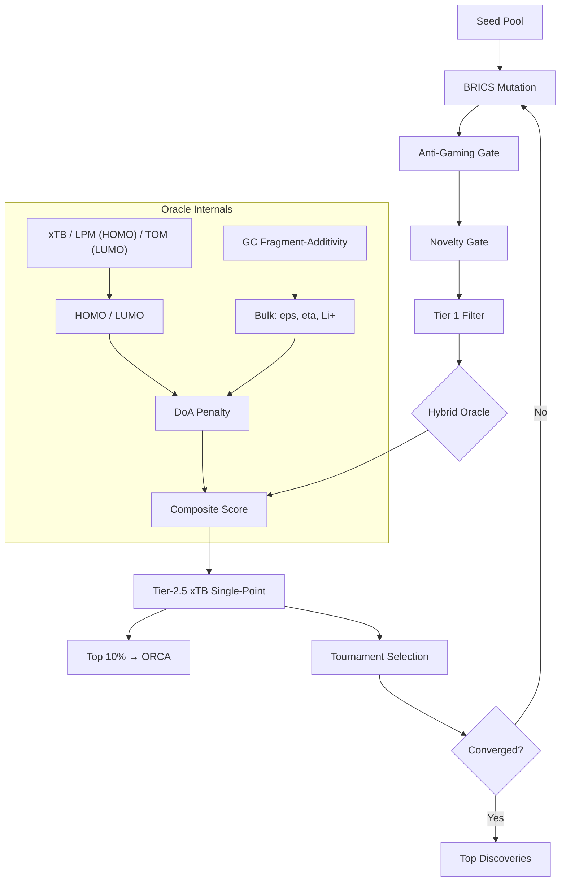

# Project Aurelius v12.0

**Novel molecule discovery for battery electrolytes.**

A physically-grounded Evolutionary Algorithm pipeline with a **hybrid quantum + fragment-additivity oracle**. Frontier orbitals (HOMO/LUMO) are predicted via quantum chemistry (xTB/GFN2-xTB preferred, Lone-Pair Orbital Model fallback) — bulk properties (dielectric, viscosity, Li+ solvation) via interpretable group-contribution fragment-additivity.

## Why Hybrid?

| Property | Method | Rationale |
|----------|--------|-----------|
| HOMO | QuantumOracle (xTB or **LPM**) | Orbitals are delocalised quantum phenomena — NOT additive. The LPM enumerates candidate ionisable lone-pair orbitals and applies Koopmans' theorem with geometric inductive attenuation. |
| LUMO | QuantumOracle (xTB or TOM) | Virtual orbitals are not accessible via Koopmans; TOM's particle-in-a-box model is retained for LUMO. |
| Dielectric ε | Kirkwood-Fröhlich (closed form) | ε is a bulk orientational response, **not** additive: it scales as μ²g/V_m and spans 2→90. Inputs (McGowan volume, Clausius-Mossotti ε∞, group dipole, correlation factor g) are all structure-derived. |
| Viscosity | GC fragment-additivity + MW + RotB | Transport properties correlate with group contributions. |
| Li+ Solvation | GC fragment-additivity | Donor-number additivity is physically valid. |
| Ionic Conductivity | Walden-product proxy (ε, η, Li⁺) | Unifies salt dissociation, mobility, and charge-carrier availability into a single figure of merit. |

The hybrid oracle (non-linear quantum HOMO/LUMO + closed-form dielectric + additive GC transport properties) keeps the pipeline physically grounded while maintaining interpretability. A Walden-product conductivity proxy combines dielectric, viscosity, and Li+ solvation into a unified transport metric (reporting only — see the docstring for its saturation caveat).

### Dielectric accuracy (ADR-2026-08-07-04)

Against 55 formula-checked, literature-cited dielectric constants
(`benchmarks/data/dielectric_verified.json`):

| Model | MAE | Spearman ρ |
|---|---|---|
| Previous fragment-additive + TPSA cap | 10.62 | 0.444 |
| **Kirkwood-Fröhlich** | **3.89** | **0.925** |
| ECFP4 + RandomForest (5-fold CV) | 18.09 | 0.116 |

On the ten canonical commercial solvents: MAE 3.01, ρ 1.00. EC 76.3 (exp
89.78), PC 61.5 (64.92), DMC 3.13 (3.11), DEC 2.81 (2.82) — cyclic carbonates
corrected without perturbing linear ones, and with no cyclic-specific term.

**Known limitation.** EC carries essentially all remaining commercial-solvent
error (MAE excluding EC is 1.85). The model uses the gas-phase dipole 4.90 D;
condensed-phase estimates reach ~5.35 D, which would give ε = 90.7. This was
not applied because it is a per-molecule adjustment rather than physics.

**Note on the ML baseline.** Earlier audits reported the oracle losing to a
fingerprint regressor. That comparison ran against benchmark entries with
incorrect reference values (see `benchmarks/data/README.md`), which a
fingerprint model can memorise and a physical model cannot. On verified
labels the ordering reverses decisively.

### Orbital accuracy (ADR-2026-08-08-01)

The Topological Orbital Model (TOM) was the v11 fallback for HOMO/LUMO.
It models the HOMO as a particle-in-a-box π orbital, which is the *wrong*
physics for the saturated electrolyte solvents (carbonates, ethers, nitriles,
sulfones) this project searches — their HOMO is a heteroatom **lone pair**.

The **Lone-Pair Orbital Model (LPM)** replaces TOM for the HOMO. It
enumerates candidate ionisable orbitals (typed lone pairs, π system, σ
bond), applies Koopmans' theorem (IP ≈ −E_HOMO), and takes the highest
(ionised) one. Substituent effects use geometric distance attenuation
(Branch–Calvin / Taft fall-off), so inductive stabilisation saturates as it
does experimentally. Class intercepts are shrunk toward Hinze–Jaffé
valence-state ionisation energies, so weakly-supported orbital types degrade
to literature chemistry rather than extrapolating.

| Model | Target | n | Spearman ρ | MAE (eV) |
|---|---|---|---|---|
| TOM | DFT orbital labels | 72 | 0.20 | 1.31 |
| TOM | DFT labels (unseen) | 45 | 0.17 | 1.79 |
| **LPM** | **Experimental gas-phase IPs (NIST)** | **88** | **0.91** | **0.38** |
| LPM | DFT labels (unseen) | 45 | 0.43 | 0.47 |

*Leakage-aware split: 27/72 molecules in `external_property_benchmark.json`
also appear in the calibration set `orbital_calibration.json`. The
leakage-aware benchmark (`benchmarks/benchmark_orbital_leakage.py`)
reports SEEN and UNSEEN splits separately.*

## Architecture



## Overview

| Component | Framework | Purpose |
|-----------|-----------|---------|
| Filter | RDKit | Electrolyte viability (MW, HBD, RotB, SA score) |
| Oracle | Quantum + GC | HOMO from xTB/LPM; LUMO from xTB/TOM; bulk (ε, η, Li⁺, σ) from fragment-additivity + Walden-product conductivity proxy |
| Mutation | SMARTS + BRICS | Targeted electrolyte edits + scaffold hopping + **mixture-native evolution** |
| Selection | Tournament / NSGA-II | Tanimoto-guided evolutionary diversity pressure + **synergy-weighted mixture selection** |
| Active Learning | Conformal + DoA + Novelty + Bias | **`aurelius suggest-experiment`** ranks measurements by expected information gain |

The composite Aurelius Score is computed via Gaussian LUMO reward (SEI formation window), sigmoid HOMO penalty (oxidative stability threshold), sigmoid dielectric/viscosity/Li-solvation/conductivity rewards, and SA score penalty. Tournament selection with a Tanimoto diversity penalty steers each generation away from chemical saturation.

## Installation

Since Aurelius relies on RDKit's C++ bindings, we recommend a conda-first installation.

```bash
# 1. Create and activate a conda environment with Python 3.11 and RDKit
conda create -n aurelius python=3.11 rdkit -c conda-forge
conda activate aurelius

# 2. Install Aurelius directly from GitHub
pip install git+https://github.com/tomwolfe/ProjectAurelius.git
```

## Quick Start

```bash
aurelius init                         # Initialize pipeline
aurelius doctor                       # Validate dependencies
aurelius doctor-xtb                   # Check xTB quantum backend
aurelius screen "CC(=O)OC1=CC=CC=C1" # Screen a molecule
aurelius suggest-experiment --top 5   # What should the chemist measure next?
aurelius agent                        # Run autonomous screening
```

## CLI Reference

```bash
aurelius init
aurelius doctor
aurelius doctor-xtb
aurelius screen <SMILES>
aurelius batch <smiles_file>
aurelius predict <SMILES>            # Standalone oracle API
aurelius score <SMILES>              # Compute Aurelius score only
aurelius evaluate <SMILES>           # Full pipeline evaluation
aurelius validate <SMILES>           # Full pipeline with per-objective scorecard
aurelius conformal [--smiles]        # Conformal prediction intervals
aurelius suggest-experiment [--top N] [--output JSON]  # Active experiment suggestion
aurelius dft-rerank [file] [--top N] # ORCA re-ranking of top candidates
aurelius agent [options]             # Autonomous screening loop
aurelius report [options]            # Wet-lab handoff report
aurelius ingest-experiment <file>    # Ingest wet-lab measurements
```

### Key agent options (v12)

| Option | Default | Description |
|--------|---------|-------------|
| `--xtb-single-point / --no-xtb-single-point` | on | Tier-2.5 mandatory xTB single-point on every Tier-1 survivor |
| `--mixture-mutation-rate` | 0.35 | Target mixture fraction (0.0 disables, recovers v11) |
| `--mixture-seed-from-known / --no-mixture-seed-from-known` | on | Seed known electrolyte blends |
| `--xtb-budget` | 10 | xTB escalation budget per generation (for `tom_low` molecules) |

## V12.0 Highlights

### Lone-Pair Orbital Model (LPM)
Replaces the particle-in-a-box Topological Orbital Model as the default non-xTB HOMO estimator.
TOM models the HOMO as a delocalised π orbital — the correct physics for polyenes, the
*wrong* physics for saturated electrolytes. The LPM enumerates typed lone-pair orbitals
(ether O, carbonyl O, amine N, nitrile N, pyridine N, sulfide S, sulfoxide S, P, Cl, Br),
applies Koopmans' theorem with geometric inductive attenuation, and shrinks class
intercepts toward Hinze–Jaffé valence ionisation energies. Against 88 NIST experimental
gas-phase ionisation energies: **Spearman ρ = 0.91, MAE = 0.38 eV** (vs TOM ρ = 0.26,
MAE = 3.78 eV). The model is fitted by physics-anchored ridge regression
(`scripts/calibrate_lone_pair.py`); all parameters stay chemically interpretable.

### Active Experiment Suggestion (`aurelius suggest-experiment`)
Closes the wet-lab loop. Ranks molecule/property pairs by expected information gain:
conformal interval width (locally adaptive — normalised conformal regression),
distance from the calibration set, proximity to the domain-of-applicability boundary,
and detected systematic bias. Each suggestion carries a plain-language rationale and
emits property names that validate against `data/experimental_results_schema.json`,
so output feeds straight back into `aurelius ingest-experiment`. Suggestions are
diversified via a compounding redundancy discount (greedy batch-mode active learning).

### Tier-2.5 Mandatory xTB Single-Point Gate
Every Tier-1 survivor gets a fast GFN2-xTB **single-point** (not geometry optimisation)
before the evolutionary loop decides which molecules graduate to the ORCA tier. A
single point (~0.3 s) is ~10x cheaper than a full optimisation and is the whole point
of a bridge tier. ORCA is reserved for the top decile of xTB-ranked survivors only.
`XTBSinglePointOracle` provides SMILES-keyed JSON caching (`xtb_cache.json`) and
graceful degradation when xTB is absent. The existing targeted escalation for
`tom_low` molecules is preserved as a complementary path.

### Mixture-Native Evolution + Synthesizability
Real electrolytes are blends. The v12 loop produces mixtures at a configurable rate
(`mixture_mutation_rate`, default 0.35; 0.0 recovers v11) with a 30% floor when
enabled. Known binary electrolyte blends from `known_electrolytes.json` are seeded
every generation. Both binary and ternary mixtures are generated (2:1 ratio).
Synergy bonus weight increased 0.3→0.5 in tournament/NSGA-II selection so
non-linear complementarity (high-ε + low-η) competes strongly against pure
components.

### Leakage-Aware Benchmarking
`benchmarks/benchmark_orbital_leakage.py` reports SEEN and UNSEEN splits separately,
exposing the calibration-set leakage that inflated v11 orbital metrics. The
external validation benchmark now includes honest numbers: TOM ρ = 0.17 (unseen)
vs LPM ρ = 0.43.

## Changelog

### v12.0 (2026-08-08)
- **LPM**: Lone-Pair Orbital Model replaces TOM for HOMO (ADR-2026-08-08-01)
- **Active loop**: `aurelius suggest-experiment` with adaptive conformal, DoA, novelty, bias (ADR-2026-08-08-02)
- **Tier-2.5**: Mandatory xTB single-point on Tier-1 survivors, ORCA for top decile (ADR-2026-08-08-02)
- **Mixtures**: `mixture_mutation_rate` (0.35), known blends seeded, synergy weight 0.3→0.5 (ADR-2026-08-08-03)
- **Benchmarks**: Leakage-aware orbital benchmark, experimental IP dataset
- **Complexity**: Refactored `ingest_experimental_results`, `dft_geometry_optimize`, `ConformalPredictor.fit` to pass cyclomatic gate

### v11.0 (2026-08-07)
- Kirkwood-Fröhlich dielectric model (ADR-2026-08-07-04)
- Eyring viscosity with rotational barrier correction
- Ternary mixture support
- DFT geometry-optimisation cascade gate
- NSGA-II 4-objective consolidation

### v10.0 (2026-08-05)
- BRICS mutation with retrosynthetic depth penalty
- Synthesizability selection (grounding score)
- FeedbackController + DeltaCorrection GPR
- Wet-lab reporting pipeline

### v9.0 (2026-08-02)
- Conformal prediction for calibrated uncertainty
- Continuous DoA penalty (sigmoids)
- Anti-gaming gate (fragment coverage)

### v8.0 (2026-07-28)
- GPU-accelerated TOM (MLX on Apple Silicon)
- xTB budget per generation
- ProcessPoolExecutor parallel evaluation

### v7.0 (2026-07-21)
- DeltaCorrection GPR residual correction
- Active learning escalation to xTB
- Experimental feedback ingestion

### v6.0 (2026-07-15)
- TOM with aromatic stabilisation + Wiener compactness
- 3D conformational correction (radius of gyration)
- Heteroatom perturbation table

### v5.0 (2026-07-08)
- Unified screening pipeline (Tier 0/1/2)
- Tournament selection with Tanimoto diversity
- Walden-product conductivity proxy

## Quantum Backend

### Preferred: xTB (GFN2-xTB)
Fast semi-empirical QM (~0.3–2 s/molecule). Provides HOMO, LUMO, dipole.
```bash
conda install -c conda-forge xtb
aurelius doctor-xtb
```

### Fallback: Lone-Pair Orbital Model (HOMO) + Topological Orbital Model (LUMO)
Closed-form analytic models with no external dependencies. LPM parameters are
fitted by `scripts/calibrate_lone_pair.py` against experimental ionisation
energies with a Hinze–Jaffé ridge prior. TOM parameters are in `tom_params.json`.

### ORCA (wB97X-D3/def2-SVP)
Single-point and geometry-optimisation tier for top candidates. Controlled
by `DFTValidator` with SMILES-keyed caching (`dft_cache.json`).

## Anti-Gaming Constraints

| Gate | Mechanism | Purpose |
|------|-----------|---------|
| Anti-Gaming | Fragment coverage penalty | Prevents fragment stacking to cheat additive models |
| Novelty Gate | Murcko scaffold distance | Ensures scaffold hopping, not alkyl extension |
| Grounding Score | BRICS coverage + template feasibility | Biases search toward synthesizable molecules |
| DoA Penalty | Continuous sigmoid on L, n_pi | Epistemic humility outside calibration domain |
| Conformal | Split conformal intervals | Distribution-free coverage guarantee |

## Project Structure

```
src/aurelius/
├── agent/                 # Autonomous screening loop
│   ├── experiment_suggester.py   # Active experiment suggestion (NEW)
│   ├── loop.py                   # DiscoveryLoop with Tier-2.5 gate
│   ├── mutation/engine.py        # Mixture-native evolution
│   └── selection.py              # Synergy-weighted tournament/NSGA-II
├── scoring/oracle/
│   ├── lone_pair.py              # LPM HOMO (NEW)
│   ├── xtb_single_point.py       # Cached xTB SP gate (NEW)
│   ├── conformal.py              # Locally-adaptive conformal (UPDATED)
│   ├── quantum.py                # QuantumOracle with LPM/TOM
│   ├── gc.py                     # Kirkwood-Fröhlich / Eyring
│   └── delta_correction.py       # GPR residual correction
├── pipeline.py
└── __main__.py                   # CLI entry points

benchmarks/
├── benchmark_orbital_leakage.py  # Leakage-aware (NEW)
├── benchmark_external_validation.py
├── benchmark_ml_baseline.py
└── data/
    ├── experimental_ionization.json    # 88 NIST IPs (NEW)
    ├── orbital_calibration.json        # 115 DFT references
    └── external_property_benchmark.json # 104 entries

scripts/
├── calibrate_lone_pair.py          # LPM fitting (NEW)
├── calibrate_tom.py
└── calibrate_gc_cross_terms.py

tests/
├── test_lone_pair.py               # LPM chemistry tests (NEW)
├── test_experiment_suggester.py    # Active learning tests (NEW)
└── ...
```

## Scientific References

- Koopmans, T. *Physica* **1**, 104 (1933) — orbital-energy / IP theorem
- Hinze, J. & Jaffé, H. *J. Phys. Chem.* **66**, 570 (1962) — valence-state IPs
- Branch, G. E. K. & Calvin, M. *J. Am. Chem. Soc.* **63**, 1311 (1941) — inductive fall-off
- Kirkwood, J. G. *J. Chem. Phys.* **7**, 911 (1939) — dielectric correlation factor
- Eyring, H. *J. Chem. Phys.* **4**, 283 (1936) — viscosity absolute rate theory
- Vovk, V., Gammerman, A. & Shafer, G. *Algorithmic Learning in a Random World* (2005) — conformal prediction
- Papadopoulos, H. *Proc. PADL* 2008 — normalised conformal regression

## License

MIT License. See LICENSE for details.