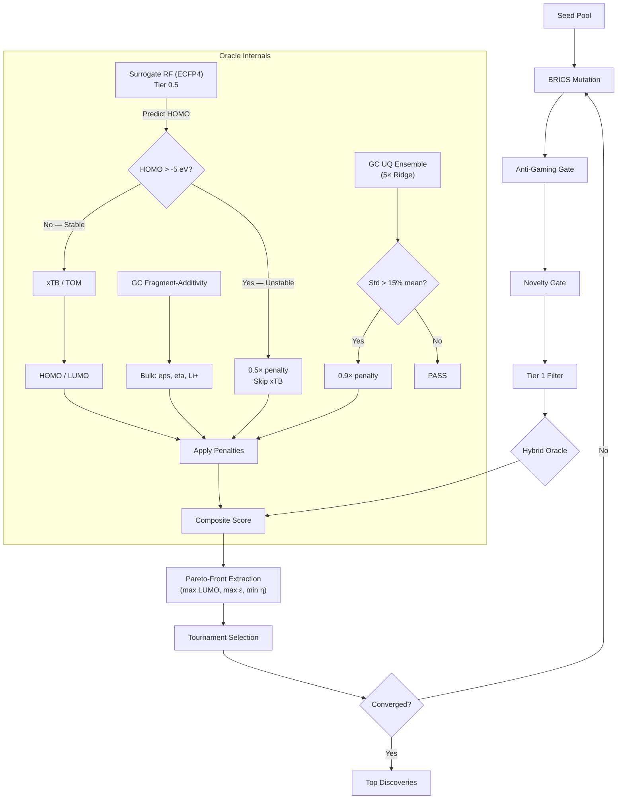

# Project Aurelius: Physics-Grounded Small Molecule Discovery Engine

> This is the **MIT-licensed** open-source engine of the Aurelius platform.
> **Certified Kernels** (`aurelius_kernel.json`) are available to tune the
> engine for specific chemical domains — see [the parent README](../README.md)
> and [Certification Protocol](../docs/certification_protocol.md).

**Novel molecule discovery for battery electrolytes, organic electronics, and catalysis.**

A physically-grounded Evolutionary Algorithm pipeline with a **hybrid quantum + fragment-additivity oracle** and **lightweight ML surrogate pre-filter**. Frontier orbitals (HOMO/LUMO) are predicted via quantum chemistry (xTB/GFN2-xTB preferred, Topological Orbital Model fallback) — bulk properties (dielectric, viscosity, Li+ solvation) via interpretable group-contribution fragment-additivity with uncertainty quantification.

## Why Hybrid?

| Property | Method | Rationale |
|----------|--------|-----------|
| HOMO / LUMO | QuantumOracle (xTB or TOM) | Orbitals are delocalised quantum phenomena — NOT additive. GC would be "gamed" by stacking fragments. |
| HOMO (pre-filter) | SurrogateQuantumOracle (RF on ECFP4) | Lightweight ML surrogate skips xTB when predicted HOMO > -5.0 eV, saving ~10s per molecule. |
| Dielectric ε | GC fragment-additivity + TPSA + UQ Ensemble | Bulk polarity is reasonably additive; 5-model Ridge ensemble provides uncertainty bounds. |
| Viscosity | GC fragment-additivity + MW + RotB + UQ Ensemble | Transport properties correlate with group contributions; high-variance predictions flagged. |
| Li+ Solvation | GC fragment-additivity | Donor-number additivity is physically valid. |
| Ionic Conductivity | Walden-product proxy (ε, η, Li⁺) | Unifies salt dissociation, mobility, and charge-carrier availability into a single figure of merit. |

The hybrid oracle (non-linear quantum HOMO/LUMO + additive GC bulk properties) keeps the pipeline physically grounded while maintaining interpretability. A Walden-product conductivity proxy combines dielectric, viscosity, and Li+ solvation into a unified transport metric.

## Architecture



## Overview

| Component | Framework | Purpose |
|-----------|-----------|---------|
| Filter | RDKit | Electrolyte viability (MW, HBD, RotB, SA score) |
| Oracle | Quantum + GC + Surrogate + UQ | HOMO/LUMO from xTB/TOM with surrogate Tier-0.5 pre-filter; bulk (ε, η, Li⁺, σ) from fragment-additivity + 5-model Ridge UQ; Pareto-front extraction on top discoveries |
| Mutation | SMARTS + BRICS | Targeted electrolyte edits + scaffold hopping |
| Selection | Tournament Selection | Tanimoto-guided evolutionary diversity pressure + Pareto-optimal subset reporting |

The composite Aurelius Score is computed via Gaussian LUMO reward (SEI formation window), sigmoid HOMO penalty (oxidative stability threshold), sigmoid dielectric/viscosity rewards, Gaussian Li-solvation reward, and SA score penalty. (The Walden-product conductivity proxy is exposed for inspection but is not a weighted objective in the composite score.) Tournament selection with a Tanimoto diversity penalty steers each generation away from chemical saturation.

## Installation

Since Aurelius relies on RDKit's C++ bindings, we recommend a conda-first installation.

```bash
# 1. Create and activate a conda environment with Python 3.11 and RDKit
conda create -n aurelius python=3.11 rdkit -c conda-forge
conda activate aurelius

# 2. Install Aurelius directly from GitHub
pip install git+https://github.com/tomwolfe/ProjectAurelius.git
```

## Quick Start

While the default configuration is optimized for battery electrolytes, the
oracle can be retuned for other chemical domains (organic electronics,
catalysis, small-molecule discovery) via the **Certification Lab** —
see [`docs/certification_protocol.md`](../docs/certification_protocol.md).

```bash
aurelius init                         # Initialize pipeline
aurelius doctor                       # Validate dependencies
aurelius doctor-xtb                   # Check xTB quantum backend
aurelius screen "CC(=O)OC1=CC=CC=C1" # Screen a molecule
aurelius batch examples/molecules.smi --output results.json  # Batch screen
aurelius agent --max-generations 50   # Run autonomous discovery loop
aurelius mixture "C1COC(=O)O1" "COCCOC" --frac 0.5  # Screen EC/DME 50:50 mixture
```

## CLI Reference

| Command | Arguments | Purpose |
|---------|-----------|---------|
| `init` | | Initialize pipeline |
| `doctor` | | Validate dependencies and hardware |
| `doctor-xtb` | | Check xTB quantum backend availability |
| `screen` | `<smiles>` | Screen a single molecule |
| `batch` | `<file>` | Screen molecules from SMILES file |
| `score` | `<smiles>` | Compute Aurelius score only |
| `evaluate` | `<smiles>` | Run ML oracle evaluation |
| `validate` | `<smiles>` | Run full pipeline with detailed scorecard and fragment-level rejection insights (top 3 contributing GC fragments per failing-property) |
| `agent` | `--max-generations --batch-size` | Run the autonomous screening agent |
| `mixture` | `<smiles_a> <smiles_b> [--frac]` | Screen a binary electrolyte mixture |

## Beyond Batteries

While Aurelius is optimized for battery electrolyte discovery, the engine's
modular hybrid oracle (quantum + fragment-additivity) generalizes to any
property that can be expressed through frontier orbital energies and
group-contribution fragment contributions. Example domains:

- **Organic Electronics**: Tune the oracle for hole/electron transport
  materials (OFETs, OLEDs) by recalibrating HOMO/LUMO targets and
  adding charge-mobility fragment contributions.
- **Catalysis**: Adapt screening to ligand design by reweighting
  frontier-orbital descriptors and incorporating metal-coordination
  fragment terms via the Certification Lab.
- **Small-Molecule Drugs**: Replace the electrolyte viability filter with
  Lipinski/Ro5 rules and recalibrate the GC fragment library for
  solvation/LogP prediction.

The **Certification Lab** provides the tooling to retune the
`tom_parameters`, `gc_fragments`, and `validation_metrics` for these
alternative domains.

## Quantum Backend

### Preferred: xTB (GFN2-xTB)
Install the xTB binary from https://xtb-docs.readthedocs.io and ensure it's on your PATH.
The oracle will automatically detect and use it.

### Fallback: Topological Orbital Model (TOM)
When xTB is unavailable, the oracle falls back to a **Topological Orbital Model (TOM)**. This closed-form physical model estimates HOMO/LUMO using conjugation path length, heteroatom perturbations, and topological compactness. For detailed mathematical formulations and calibration metrics, see [`paper/manuscript.md`](paper/manuscript.md) and [`docs/benchmarks.md`](docs/benchmarks.md).

## Anti-Gaming Constraints

The mutation engine includes topological safeguards:
- **Max conjugation path**: 16 atoms (prevents infinitely conjugated "Frankenstein" molecules)
- **Min sp³ carbon fraction**: 20% (ensures 3D structural complexity)
- **Max rings**: 3 (electrolytes are small molecules, not drug-like macrocycles)
- **Strained ring rejection**: 3-4 membered rings (electrochemically unstable)

## Project Structure

```
src/aurelius/
├── __main__.py             # CLI entry point
├── agent/
│   ├── loop.py             # DiscoveryLoop (Evolutionary Algorithm)
│   ├── mutation/
│   │   ├── brics.py        # BRICS decomposition / recombination
│   │   ├── engine.py       # Mutation engine orchestration
│   │   ├── harvester.py    # External SMILES harvest / caching
│   │   ├── novelty.py      # Novelty gate (Tanimoto similarity)
│   │   └── smarts.py       # SMARTS-based targeted mutations
│   ├── reporting.py        # Report generation
│   ├── selection.py        # Tournament selection + diversity penalty
│   └── state.py            # Checkpoint, convergence, feedback
├── cli_scripts/            # CLI subcommand package
├── constants.py            # Global constants
├── data/                   # Calibration & benchmark data (JSON)
├── pipeline.py             # Pipeline orchestrator
├── scoring/
│   └── oracle/
│       ├── gc.py           # Group-contribution fragment-additivity + UQ Ensemble
│       ├── oracle.py       # PropertyOracle (composite scorer, surrogate integration)
│       ├── quantum.py      # xTB / Topological Orbital Model (TOM)
│       └── surrogate.py    # SurrogateQuantumOracle (RF Tier-0.5 pre-filter)
├── screening/
│   └── tier1/filter.py     # Electrolyte viability filter
├── types.py                # Shared type definitions
└── utils/
    ├── chem_utils.py       # Chemical utilities
    └── dependencies.py     # Dependency checks
```

## Scientific References

- Bannwarth, C. et al. "GFN2-xTB — An Accurate and Broadly Parametrized Self-Consistent Tight-Binding QM Method." *J. Chem. Theory Comput.* 2019.
- Morgan, H. L. "The Generation of a Unique Machine Description for Chemical Structures." *J. Chem. Doc.* 1965.
- Heilbronner, E. & Bock, H. "The HMO Model and its Application." *Wiley-VCH* 1976.
- Degen, J. et al. "SMARTS — A Language for Describing Molecular Patterns." *J. Chem. Inf. Model.* 2008.
- Delphi, L. et al. "BRICS: Decomposition and Reassembly of Molecules." *J. Chem. Inf. Model.* 2008.

## License

MIT License
